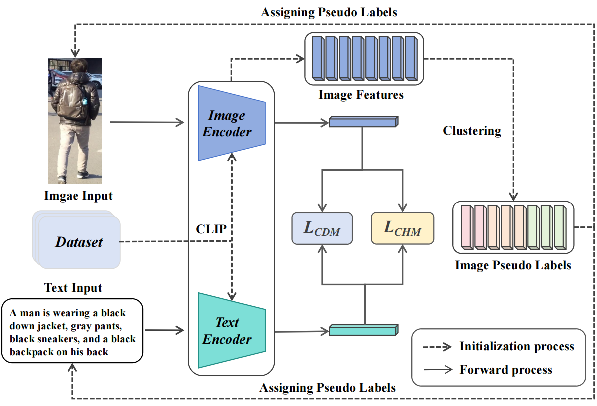

# **Image-Centered Pseudo Label Generation for Weakly Supervised Text-Based Person Re-Identification(Accepted By PRCV2024)**

## Authors: Weizhi Nie, Chengji Wang(*), Hao Sun, and Wei Xie

## Highlights

The goal of this work is to improve the performance of global text to image person retrieval under weakly supervised settings. To achieve this, we utilize the complete CLIP model as our feature extraction backbone. In addition, we propose an Image-Centered Pseudo Label Generation method to address the issues of uncertain cross-modal pseudo identity labels.

